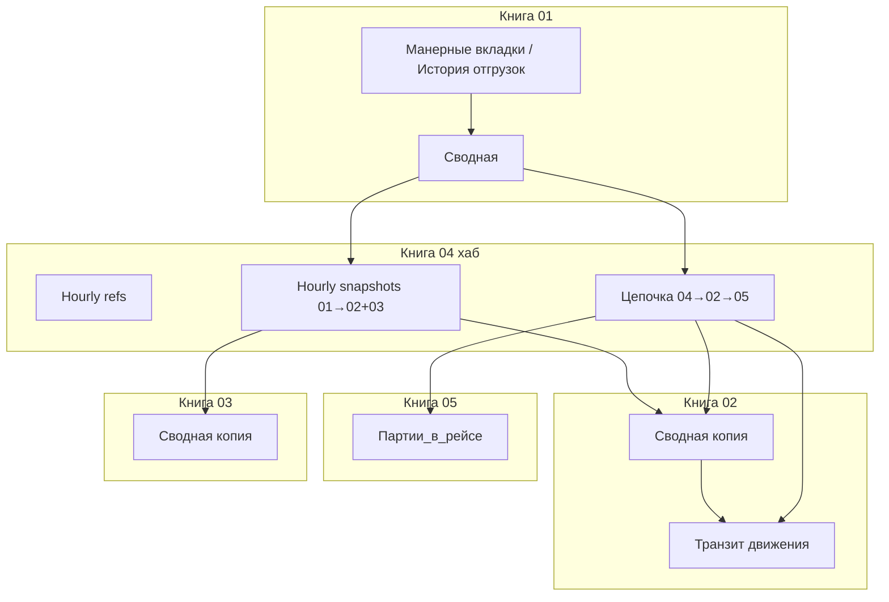

# Реестр блоков синхронизации Gremlin (Spec Kit)

**Версия**: 1.0.0 | **Дата**: 2026-05-19  
**Журнал**: лист `SYNC_LOG` в книге **04** (колонки Timestamp, Block, Status, DryRun, User, Details)  
**Конституция**: `.specify/memory/constitution.md`

Этот документ — **операционный анализ** всех блоков, попадающих в `SYNC_LOG`, плюс связанных меню без журнала. Для каждого блока — роль, когда запускать, статус Spec Kit и **следующее действие**.

---

## 1. Сквозной процесс (как блоки стыкуются)

**Рекомендуемый ручной цикл после отгрузки в рейс:**

1. Собрать «Сводную» в **01** (меню МойСклад или hourly).
2. **Цепочка 04→02→05 (боевой)** в **04** — один раз вместо отдельных 01→02 + транзит + партии.
3. При необходимости планирования закупок — отдельно **01→03** (в цепочку не входит).

**Не дублировать:** если запустили **Цепочку**, отдельный **01→02 Сводная** не нужен (шаг 1 цепочки то же самое).

---

## 2. Блоки `SYNC_LOG` (sync_hub.gs)

| Block | Назначение | Книги | Ручной запуск (04) | Расписание | Spec Kit | Действие |
|-------|------------|-------|-------------------|------------|----------|----------|
| **Цепочка 04→02→05** | 01→02 + пересчёт транзита + safe-партии | 01,02,05 | Операционные потоки → dry-run / боевой | нет | ✅ `001-sync-chain` — **проверено** | **OPERATE**: основной ручной поток после отгрузки; **GIT**: merge `001-sync-chain-04` → `main` |
| **01→02 Сводная** | Копия сводной только в 02 | 01→02 | Операционные потоки → 01→02 и 03 *или* отдельно через снимки | внутри Hourly snapshots | покрыто цепочкой | **OPERATE**: только если нужен **только** 02 без транзита/партий; иначе не запускать после цепочки |
| **01→03 Сводная** | Копия сводной в 03 (планирование) | 01→03 | Операционные потоки → 01→03 | внутри Hourly snapshots | нет spec | **SPECIFY** при доработке закупок: `/speckit-specify` «снимок 01→03 и in-transit» |
| **04→01 Справочники** | Товары + поставщики из 04 в 01 | 04→01 | Синхронизировать справочники (из 04) | Hourly refs | нет spec | **OPERATE**: после обновления справочников в 04; **MONITOR** SYNC_LOG |
| **04→01/02/05 Статусы** | Справочник статусов во все книги | 04→01,02,05 | Полная синхронизация / dry-run все потоки | в составе полной | нет spec | **OPERATE**: редко, после смены статусов в 04; dry-run сначала |
| **05→04 Справочники** | Каталог из рейсов, таможня, типы событий в 04 | 05→04 | Собрать справочники в 04 (из 05) | в составе полной | нет spec | **OPERATE**: после изменений в 05 (рейсы, нормативы) |
| **RESTORE 04 Товары** | Полный справочник товаров из внешней книги | внешняя→04 | Восстановить полный «Справочник товары»… | начало Hourly refs | нет spec | **OPERATE**: по необходимости восстановления; не hourly без нужды |
| **RESTORE 04 Поставщики** | Поставщики из внешней книги | внешняя→04 | (в составе restore / hourly) | Hourly refs | нет spec | **OPERATE**: если `MASTER_REF_EXTERNAL_*` включён |

---

## 3. Блоки расписания (`gremlin_scheduled.gs`)

Пишутся в тот же `SYNC_LOG` через `gremlinScheduleLog_` → `syncHubLog_`.

| Block | Назначение | Книга триггера | Состав | Spec Kit | Действие |
|-------|------------|----------------|--------|----------|----------|
| **Hourly refs** | Внешние → 04 → 01 справочники | 04 | restore + 04→01 | нет spec | **OPERATE**: убедиться `SCHEDULE_ENABLED=on`, триггеры 04 установлены; смотреть OK в логе |
| **Hourly snapshots** | **01→02 и 01→03** (не транзит, не партии) | 04 | `syncOperationalSnapshotsImpl_` | частично | **PLAN** (опционально): `/speckit-specify` «после hourly snapshots вызывать цепочку шаги 2–3» — сейчас **не** автоматизировано |
| **Hourly summary** | Сбор «Сводной» из вкладок | 01 | `syncManagerTabsToSummary` | нет spec | **OPERATE**: триггеры 01; должно идти **до** снимков/цепочки |
| **Daily payments 01** | Оплаты из реестра → 01 | 01 | `paySyncPaidStatuses` | нет spec | **OPERATE**: ежедневно 07:00; отдельная доменная spec при сбоях |
| **Daily payments 05** | Оплаты логистики → 05 | 05 | `payLogSyncPaidStatuses` | нет spec | **OPERATE**: то же для книги 05 |

**Разрыв процесса (важно):** hourly в 04 обновляет сводные в 02/03, но **не** пересчитывает транзит и **не** наполняет партии. После автоматического hourly оператору при отгрузках всё равно нужна **Цепочка** (или ручные шаги 2–3).

---

## 4. Блоки costing (книга 05, опционально в 04)

| Block | Назначение | Книги | Ручной запуск | Spec Kit | Действие |
|-------|------------|-------|---------------|----------|----------|
| **costing.rebuildBatchesFromSummary** | Партии из сводной (safe/refresh/full) | 01→05 | 💰 Себестоимость → Партии… | дублирует шаг 3 цепочки | **OPERATE**: для refresh_qty / full_rebuild; для safe после отгрузки — **цепочка**, не отдельный пункт |

---

## 5. Меню без `SYNC_LOG` (вне реестра блоков, кратко)

| Область | Книга | Примеры | Spec Kit |
|---------|-------|---------|----------|
| МойСклад | 01 | syncOrdersWithMS, Закуплено | отдельные фичи по запросу |
| Транзит | 02 | Пересчитать движения (локально) | покрыто refactor impl |
| Себестоимость | 05 | пересчёт SKU, декларации XML | отдельные specs |
| Логистика | 01/05 | ETA, события рейса | `logistics.gs` |
| Оплаты | 01/05 | заявки, реестр | payment_requests*.gs |
| Планирование закупок | 03 | WB/Ozon остатки, расчёт | procurement_planning.gs |

Приоритет следующих **/speckit-specify** из `PROJECT_CONTEXT.md`: **отгрузка выделенных строк в рейс (01)**.

---

## 6. Интерпретация вашего прогона (2026-05-19 7:39–7:40)

| Строка лога | Вердикт |
|-------------|---------|
| `01→02 Сводная` + `Цепочка 04→02→05` подряд | Шаг 1 **дублирован** — на будущее только **Цепочка** |
| Шаг 2: 2 движения, 341 строка | OK — мало движений = мало строк со статусом «движения» |
| Шаг 3: добавится 0, без изм. 79 | OK — все пары рейс+SKU уже в «Партии_в_рейсе» (safe) |

---

## 7. План действий Spec Kit (приоритет)

### Сейчас (закрытие фичи 001)

| # | Команда / действие | Артефакт | Статус |
|---|-------------------|----------|--------|
| A1 | Отметить T008 выполненным | `specs/001-sync-chain-04-02-05/tasks.md` | сделать |
| A2 | Merge ветки `001-sync-chain-04` → `main` | GitHub PR | **рекомендуется** |
| A3 | Обновить checkpoint в `PROJECT_CONTEXT.md` | «цепочка в production» | после merge |

### Операционная дисциплина (без нового кода)

| # | Действие |
|---|----------|
| B1 | После отгрузки: Сводная (01) → **Цепочка боевой** (04) |
| B2 | Не запускать отдельно 01→02, если уже запущена цепочка |
| B3 | 01→03 — отдельно, когда нужно планирование в 03 |
| B4 | Раз в неделю просматривать `SYNC_LOG` на ERROR |

### Следующие фичи (новые ветки Spec Kit)

| # | Команда | Тема | Приоритет |
|---|---------|------|-----------|
| C1 | `/speckit-specify` | «Списать выделенные строки в рейс» (01) | P1 |
| C2 | `/speckit-specify` | «Hourly: после снимка 01→02 опционально шаги 2–3 цепочки» | P2 |
| C3 | `/speckit-specify` | Единый playbook закупок (03 + 01→03 + остатки) | P3 |

Для C1–C3: `plan` → `tasks` → `implement` → dry-run в таблицах → merge.

---

## 8. Соответствие конституции (все блоки)

| Принцип | Риск в текущих блоках | Митигация |
|---------|----------------------|-----------|
| III Источник правды | 01→02 перезаписывает сводную в 02 | Ожидаемо; транзит читает 02 |
| VI Safe | full_rebuild партий | Только ручное меню в 05, не цепочка |
| V Деплой | цепочка требует 3 файла в 04 | README.txt обновлён |

---

## 9. Чеклист владельца (еженедельно)

- [ ] `SYNC_LOG`: нет необъяснённых ERROR
- [ ] Триггеры 01/04/05 активны (`SCHEDULE_ENABLED`)
- [ ] После крупной отгрузки — цепочка dry-run → боевой
- [ ] При новых рейсах в сводной — шаг 3 показывает `добавится N > 0`
